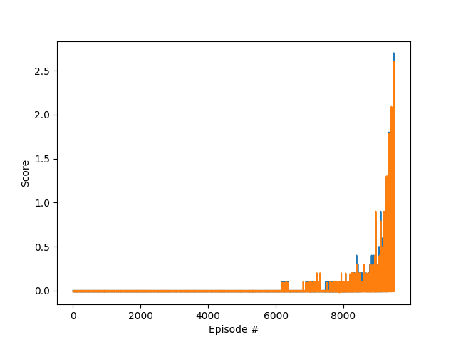
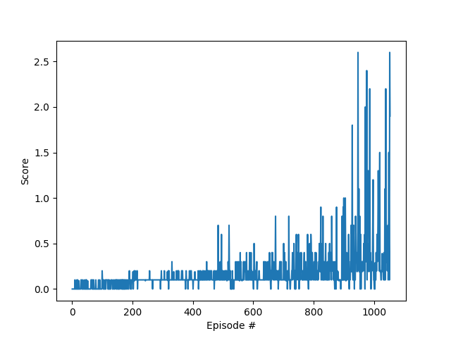

## Learning Algorithm

#### Baseline - 2nd Project Algorithm: 1 Instance of DDPG Agent
My starting point was my solution of project 2 (which in turn 
used Udacity's implementation of DDPG in the official Github repository
https://github.com/udacity/deep-reinforcement-learning as starting point). For project 2, 
we had an environment with 20 (non-interacting) agents, 
and I was curious how the very same approach would 
work for this project with 2 interacting agents.

I have not changed the basic architecture of the project 2 solution, which means
that the following network structure and 
hyperparameters has been used for this experiment:

- 2 layer network for actor and critic
- hidden nodes in actor Layer 1 = 256 
- hidden nodes in actor Layer 2 = 128 
- hidden nodes in critic Layer 1 = 256
- hidden nodes in critic Layer 2 = 128 
- ReLU activation function
- tanh layer as output
- replay buffer_size = 100000
- batch size = 128 
- discount factor = 0.99            
- soft update tau = 0.001  
- learning rate for actor = 1e-4    
- learning rate for critic =  1e-4        
- L2 weight_decay = 0 
- seed = 0
- no exploration noise decay

##### Result of Baseline
This (to my surprise) already solved the environment and fulfills Udacity's solution 
criteria:

However, the agent needed 9406 steps to solve the environment, which is a rather poor performance.

#### 2nd Experiment - 2 Instances of DDPG Agent
As a second experiment, I initiated 2 single instances of the DDPG agent class 
(that share the same experience memory, however), while using
the same hyperparameters of the baseline approach. 

##### Results of the 2nd Experiment

Due to time and resource constraint, I cancelled the experiment after 4000 episodes. At that time, the 
average reward was about 0.2, which was not even 50% of the required 0.5. 

#### 3rd Experiment - Hyperparameter Tuning and Exploration Boost + Decay
Since hyperparameter tuning is very expensive in deep reinforcement learning, I have only tried out parameters
that have proven to be useful. These have been found out by discussing this with other students in the Udacity 
slack channel. As a result, this is not "tuning" per se but rather one run with different hyperparameters:

| Hyperparameter        |  Value   |
| ------------- |  ------------ |
| replay buffer_size | 100000 -> 1000000   |
| soft update tau  | 0.001 -> 0.0002 |
| learning rate for actor |  1e-4 -> 1e-3 |
| learning rate for critic |  1e-4 -> 1e-3  |

In addition, what was reported to have a big impact on performance was the increase of exploration in early 
stages of the game. Thus, the exploration in the Ornstein-Uhlenbeck process 
was multiplied by a factor of epsilon, which decayed each step according to 

epsilon = epsilon - (1 / epsilon_decay)

##### Results 
The aforementioned changes improved the performance dramatically: 
the environment was solved after 953 episodes, which is clearly better than either of the two first approaches.

### Ideas for Future Work
As always with machine learning projects, more 
hyperparameter tuning could yield even better results.
But since it takes quite long to get to 
a result and since this is a very resource-intensive 
task, I leave this as an idea for future work. 
Also, I'm sure there are different algorithms other than 
MADDPG suited for multi-agent RL and I'll be sure to 
try some of them on my own at a later stage! 

